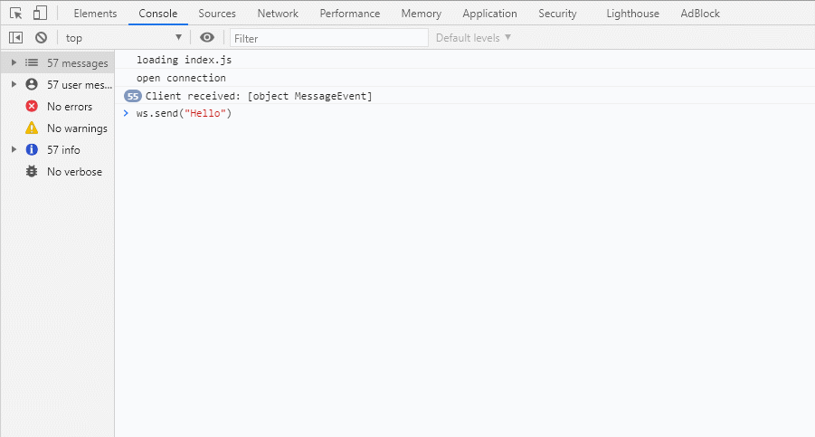

# Hello Websocket

As a demo project for practicing websocket.

## Launch websocket server

```
node server.js
```

## Launch client

- open ./client/index.html in browser

## Skill

- server
    - express
    - ws
- client
    - WebSocket

## Event

- server
    - on **connection**
    - on **message**
    - on **close**

- client
    - **onopen**
    - **onmessage**
    - **onclose**

## Messaging

- server
```
ws.send(<message>:string)
```
```
wws.clients.forEach(client=>client.send(<message>:string))
```

- client
```
ws.send(<message>:string)
```

## Result

